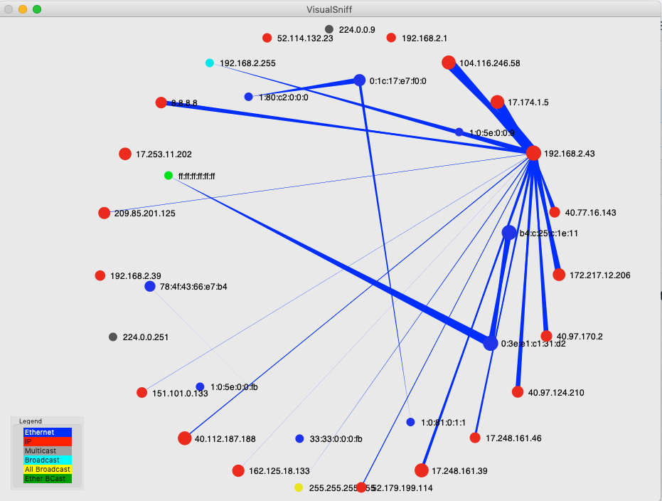

# VisualSniff
A reimplementation of the EtherApe style display for OS X.  Note that this is not a fork of EtherApe.  Written in a kinder, gentler, day when Objective-C had not yet been supplanted with this Swift nonsense.

This code is released under the GPL 3.0

    VisualSniff, a reimplementation of the EtherApe style display for OS X.
    Copyright (C) 2011  David Hoelzer

    This program is free software: you can redistribute it and/or modify
    it under the terms of the GNU General Public License as published by
    the Free Software Foundation, either version 3 of the License, or
    (at your option) any later version.

    This program is distributed in the hope that it will be useful,
    but WITHOUT ANY WARRANTY; without even the implied warranty of
    MERCHANTABILITY or FITNESS FOR A PARTICULAR PURPOSE.  See the
    GNU General Public License for more details.

    You should have received a copy of the GNU General Public License
    along with this program.  If not, see <https://www.gnu.org/licenses/>.
